Java 7 introduced a new type of `ExecutorService` ([Java Doc](https://docs.oracle.com/javase/7/docs/api/java/util/concurrent/ExecutorService.html)) called **Fork/Join Framework** ([Tutorial](https://docs.oracle.com/javase/tutorial/essential/concurrency/forkjoin.html)), which excels in handling recursive algorithms.  Different from other implementations of the `ExecutorService`, the Fork/Join Framework uses a work-stealing algorithm ([Paper](http://gee.cs.oswego.edu/dl/papers/fj.pdf)), which maximise the threads utilisation, and provides a simpler way to deal with tasks which spawn other tasks (referred to as _subtasks_).

All code listed below is available at: [https://github.com/javacreed/java-fork-join-example](https://github.com/javacreed/java-fork-join-example).  Most of the examples will not contain the whole code and may omit fragments which are not relevant to the example being discussed.  The readers can download or view all code from the above link.

This article provides a brief description of what is referred to as traditional executor service (so to called them) and how these work.  It then introduces the Fork/Join Framework and describes how this differentiates from the traditional executor service.  The third section in this article shows a practical example of the Fork/Join Framework and demonstrates most of its main components.

## Executor Service

A bank, or post office, has several counters from where the customers are served at the branches.  When a counter finishes with the current customer, the next customer in the queue will take its place and the person behind the counter, also referred to as the _employee_, starts serving the new customer.  The employee will only serve one customer at a given point in time and the customers in the queue need to wait for their turn.  Furthermore, the employees are very patient and will never ask their customers to leave or step aside, even if these are waiting for something else to happen.  The following image shows a simple view of the customers waiting and the employees serving the customers at the head of the queue.

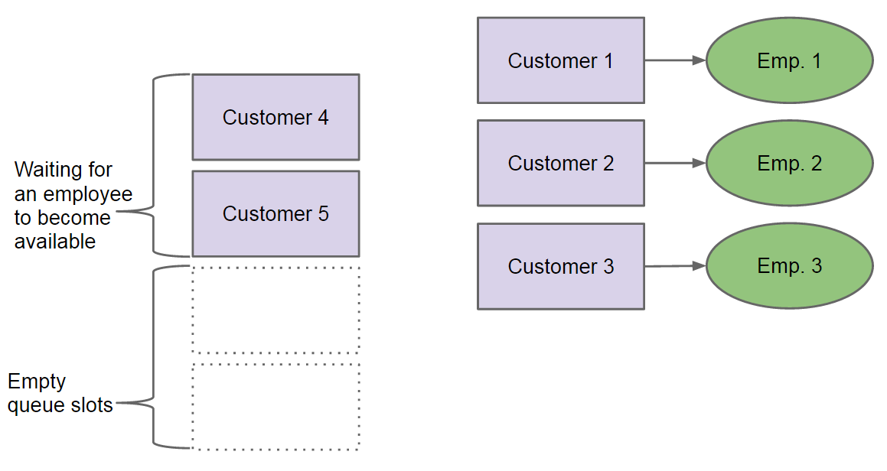

Something similar happens in a multithreaded program where the `Thread`s ([Java Doc](http://docs.oracle.com/javase/7/docs/api/java/lang/Thread.html)) represents the employees and the tasks to be carried out are the customers.  The following image is identical to the above, with just the labels updated to use the programming terminology.

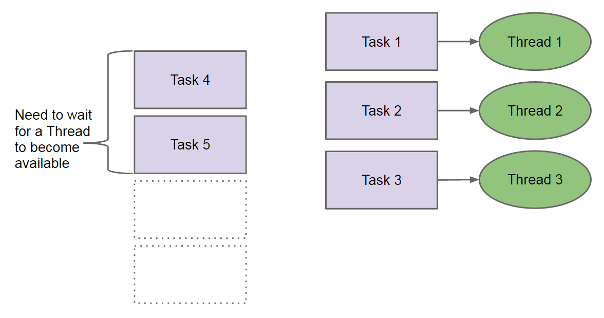

This should help you relate these two aspects and better visualise the scenario being discussed.

Most of the thread pools ([Tutorial](https://docs.oracle.com/javase/tutorial/essential/concurrency/pools.html)) and executor services work in this manner.  A `Thread` is assigned a _task_ and will only move to the next _task_ once the one at hand is finished.  Tasks can take quite a long time to finish and may block waiting for something else to happen.  This works well in many cases, but fails badly with problems that need to be solved recursively.

Let us use the same analogy that we used before with the customer waiting in the queue.  Say that _Customer 1_, who is being served by _Employee 1_, needs some information from _Customer 6_, who is not yet in the queue.  He or she (_Customer 1_) calls their friend (_Customer 6_) and waits for him or her (_Customer 6_) to come to the bank.  In the meantime, _Customer 1_ stays at the counter occupying _Employee 1_.  As mentioned before, the employees are very patient and will never send a customer back to the queue or ask them to step aside until all his or her dependencies are resolved.  _Customer 6_ arrives and queues as shown below.

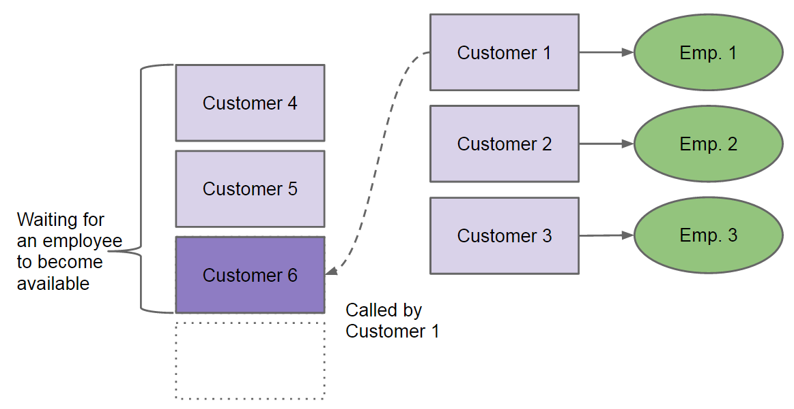

With _Customer 1_ still occupying an employee, and for the sake of this argument the other customers, _Customer 2_ and _Customer 3_, too do the same (that is wait for something which is queued), then we have a deadlock.  All employees are occupied by customers that are waiting for something to happen.  Therefore the employees will never be free to serve the other customers.

In this example we saw a weakness of the traditional executor services when dealing with tasks, which in turn depend on other tasks created by them (referred to as subtasks).  This is very common in recursive algorithms such as Towers of Hanoi ([Wiki](http://en.wikipedia.org/wiki/Tower_of_Hanoi)) or exploring a tree like data structure (calculating the total size of a directory).  The Fork/Join Framework was designed to address such problems as we will see in the following section.  Later on in this article we will also see an example of the problem discussed in this section.

## Fork/Join Framework

The main weakness of the traditional executor service implementations when dealing with tasks, which in turn depend on other subtasks, is that a thread is not able to put a task back to the queue or to the side and then serves/executes an new task.  The Fork/Join Framework addresses this limitation by introducing another layer between the tasks and the threads executing them, which allows the threads to put blocked tasks on the side and deal with them when all their dependencies are executed.  In other words, if _Task 1_ depends on _Task 6_, which task (_Task 6_) was created by _Task 1_, then _Task 1_ is placed on the side and is only executed once _Task 6_ is executed.  This frees the thread from _Task 1_, and allows it to execute other tasks, something which is not possible with the traditional executor service implementations.

This is achieved by the use of _fork_ and _join_ operations provided by the framework (hence the name Fork/Join).  _Task 1_ forks _Task 6_ and then joins it to wait for the result.  The fork operation puts _Task 6_ on the queue while the join operation allows _Thread 1_ to put _Task 1_ on the side until _Task 6_ completes.  This is how the fork/join works, fork pushes new things to the queue while the join causes the current task to be sided until it can proceed, thus blocking no threads.

The Fork/Join Framework makes use of a special kind of thread pool called `ForkJoinPool` ([Java Doc](https://docs.oracle.com/javase/7/docs/api/java/util/concurrent/ForkJoinPool.html)), which differentiates it from the rest.  `ForkJoinPool` implements a work-stealing algorithm and can execute `ForkJoinTask` ([Java Doc](https://docs.oracle.com/javase/7/docs/api/java/util/concurrent/ForkJoinTask.html)) objects.  The `ForkJoinPool` maintains a number of threads, which number is typically based on the number of CPUs available.  Each thread has a special kind of queue, `Deque`s ([Java Doc](https://docs.oracle.com/javase/7/docs/api/java/util/Deque.html)), where all its tasks are placed.  This is quite an important point to understand.  The threads do not share a common queue, but each thread has its own queue as shown next.

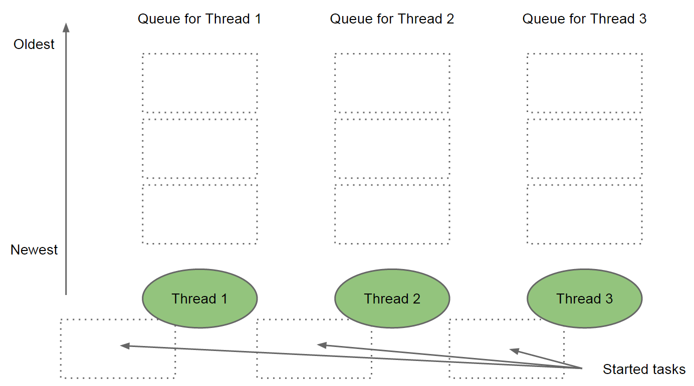

The above image illustrates another queue that each thread has (lower part of the image).  This queue, so to call it, allows the threads to put aside tasks which are blocked waiting for something else to happen.  In other words, if the current task cannot proceed (as it performs a _join_ on a subtask), then it is placed on this queue until all of its dependencies are ready.

New tasks are added to the thread's queue (using the _fork_ operation) and each thread always processes the last task added to its queue.  This is quite important.  If the queue of a thread has two tasks, the last task added to the queue is processed first.  This is referred to as last in first out, LIFO ([Wiki](http://en.wikipedia.org/wiki/LIFO_%28computing%29)).  

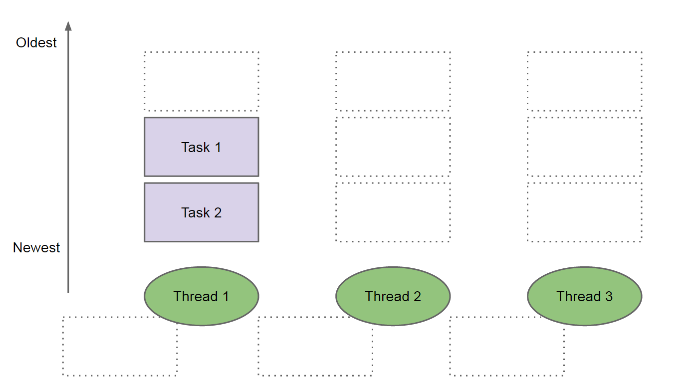

In the above image, _Thread 1_ has two tasks in its queue, where _Task 1_ was added to the queue before _Task 2_.  Therefore, _Task 2_ will be executed first by _Thread 1_ and then it executes _Task 1_.   Any idle threads can take tasks from the other threads queues if available, that is, work-stealing.  A thread will always steal oldest tasks from some other thread's queue as shown in the following image.

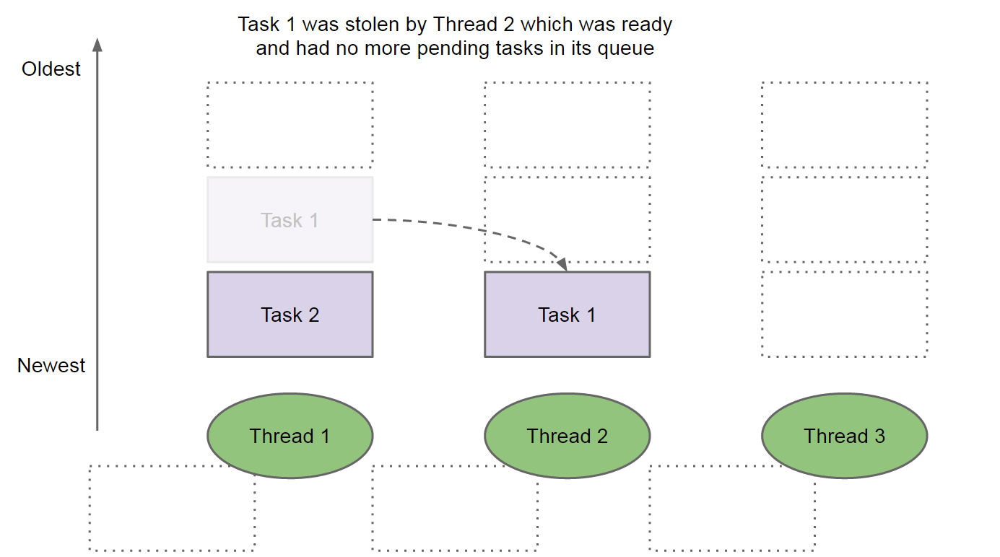

As shown in the above image, _Thread 2_ stole the oldest task, _Task 1_, from _Thread 1_.  As a rule of thumb, threads will always attempt to steal from their neighbouring thread to minimise the contention that may be created during the work stealing.

The order in which tasks are executed and stolen is quite important.  Ideally, work-stealing does not happen a lot as this has a cost.  When a task is moved from one thread to another, the context related with this task needs to be moved from one thread's stack to another.  The threads may be (and the Fork/Join framework spread work across all CPUs) on another CPU.  Moving thread context from one CPU to another can be even slower.  Therefore, the Fork/Join Framework minimises this as described next.

A recursive algorithm starts with a large problem and applies a divide-and-conquer technique to break down the problem into smaller parts, until these are small enough to be solved directly.  The first task added to the queue is the largest task.  The first task will break the problem into a set of smaller tasks, which tasks are added to the queue as shown next.

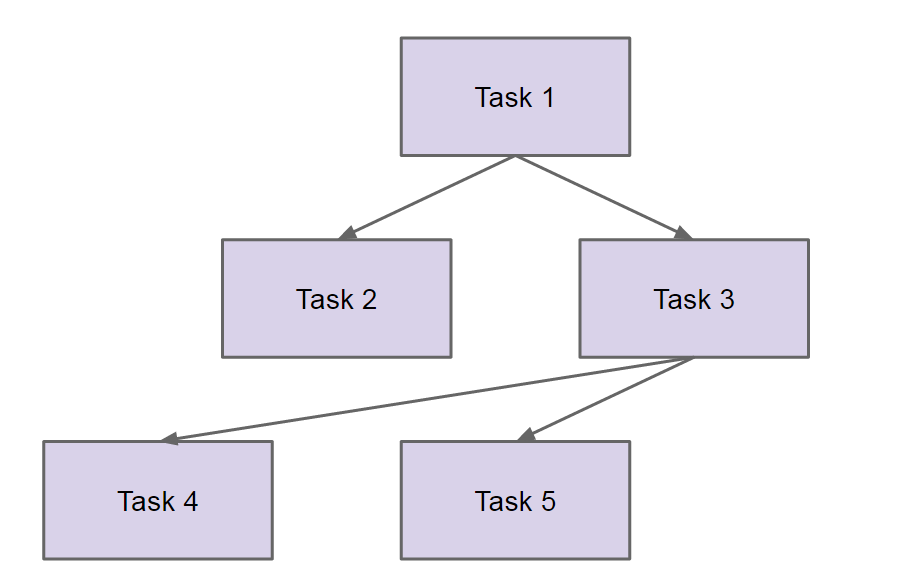

_Task 1_ represents our problem, which is divided into two tasks,  _Task 2_ is small enough to solve as is, but _Task 3_ needs to be divided further.  Tasks _Task 4_ and _Task 5_ are small enough and these require no further splitting.  This represents a typical recursive algorithm which can be split into smaller parts and then aggregates the results when ready.  A practical example of such algorithm is calculating the size of a directory.  We know that the size of a directory is equal to the size of its files.

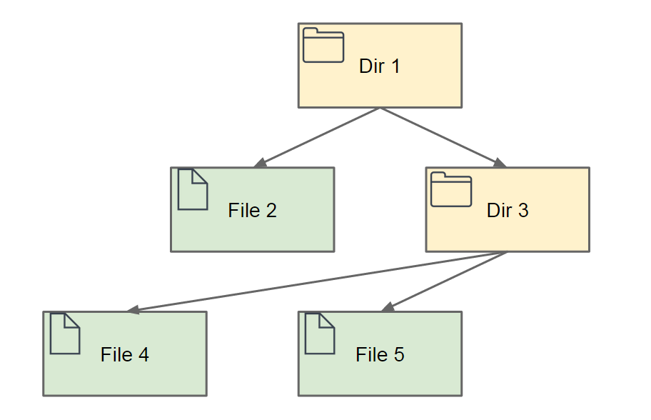

Therefore the size of _Dir 1_ is equal to the size of _File 2_ plus the size of _Dir 3_.  Since _Dir 3_ is a directory, its size is equal to the size of its content.  In other words, the size of _Dir 3_ is equal to the size of _File 4_ plus the size of _File 5_.

Let us see how this is executed.  We start with one task, that is, to compute the size of directory as shown in the following image.

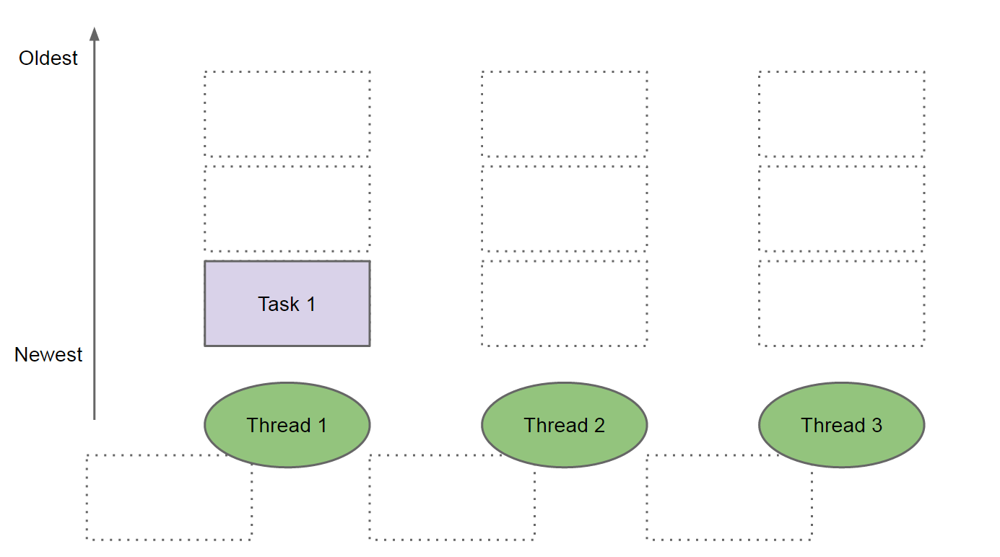

_Thread 1_ will take _Task 1_ which tasks forks two other subtasks.  These tasks are added to the queue of _Thread 1_ as shown in the next image.

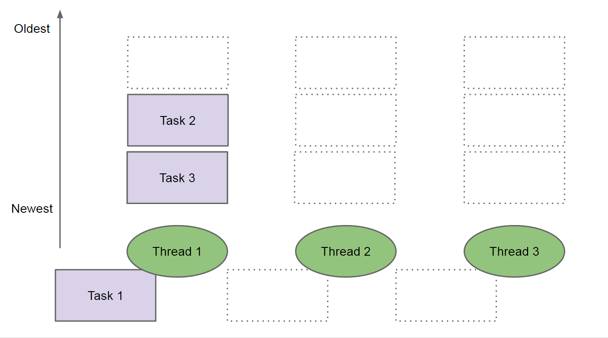

_Task 1_ is waiting for the subtasks, _Task 2_ and _Task 3_ to finish, thus is pushed aside which frees _Thread 1_.  To use better terminology, _Task 1_ joins the subtasks _Task 2_ and _Task 3_.  _Thread 1_ starts executing _Task 3_ (the last task added to its queue), while _Thread 2_ steals _Task 2_.  


Note that _Thread 1_ has already started processing its second task, while _Thread 3_ is still idle.  As we will see later on, the threads will not perform the same number of work and the first thread will always produce more than the last thread.  _Task 3_ forks two more subtasks which are added to the queue of the thread that is executing it.  Therefore, two more tasks are added to _Thread 1_'s queue.  _Thread 2_, ready from _Task 2_, steals again another task as shown next.

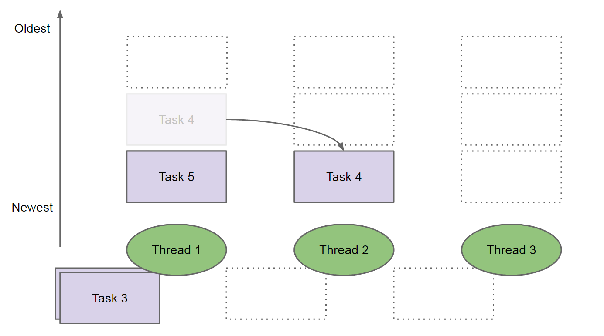

In the above example, we saw that _Thread 3_ never executed a task.  This is because we only have very little subtasks.  Once _Task 4_ and _Task 5_ are ready, their results are used to compute _Task 3_ and then _Task 1_.

As hinted before, the work is not evenly distributed among threads.  The following chart shows how the work is distributed amongst threads when calculating the size of a reasonably large directory.

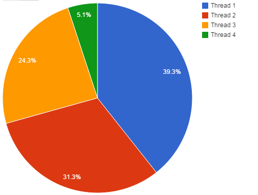

In the above example four threads were used.  As expected, Thread 1 performs almost 40% of the work while Thread 4 (the last thread) performs slightly more than 5% of the work.  This is another important principle to understand.  The Fork/Join Framework will not distribute work amongst threads evenly and will try to minimise the number of threads utilised.  The second threads will only take work from the first thread is this is not cooping.  As mentioned before, moving tasks between threads has a cost which the framework tries to minimise.

This section described on some detail how the Fork/Join Framework works and how threads steal work from other threads' queue.  In the following section we will see several practical example of the Fork/Join Framework and will analyse the obtained results.

## Calculate Directory Total Size

To demonstrate the use of the Fork/Join Framework, we will calculate the size of a directory, which problem can be solved recursively.  The size of file can determined by the method `length()` ([Java Doc](http://docs.oracle.com/javase/7/docs/api/java/io/File.html#length())).  The size of a directory is equal to the size of all its files.  

We will use several approaches to calculate the size of a directory, some of which will use the Fork/Join Framework, and we will analyse the obtained results in each case.

## Using a Single Thread (no-concurrency)

The first example will not make use of threads and simple defines the algorithm to the used.

```java
package com.javacreed.examples.concurrency.part1;

import java.io.File;

import org.slf4j.Logger;
import org.slf4j.LoggerFactory;

public class DirSize {

  private static final Logger LOGGER = LoggerFactory.getLogger(DirSize.class);

  public static long sizeOf(final File file) {
    DirSize.LOGGER.debug("Computing size of: {}", file);

    long size = 0;

    /* Ignore files which are not files and dirs */
    if (file.isFile()) {
      size = file.length();
    } else {
      final File[] children = file.listFiles();
      if (children != null) {
        for (final File child : children) {
          size += DirSize.sizeOf(child);
        }
      }
    }

    return size;
  }
}
```

The class `DirSize ` has a single method called `sizeOf()`, which method takes a `File` ([Java Doc](http://docs.oracle.com/javase/7/docs/api/java/io/File.html)) instance as its argument.  If this instance is a file, then the method returns the file's length otherwise, if this is a directory, this method calls the method `sizeOf()` for each of the files within the directory and returns the total size.

The following example shows how to run this example, using the file path as defined by `FilePath.TEST_DIR` constant.

```java
package com.javacreed.examples.concurrency.part1;

import org.slf4j.Logger;
import org.slf4j.LoggerFactory;

import com.javacreed.examples.concurrency.utils.FilePath;

public class Example1 {

  private static final Logger LOGGER = LoggerFactory.getLogger(Example1.class);

  public static void main(final String[] args) {
    final long start = System.nanoTime();
    final long size = DirSize.sizeOf(FilePath.TEST_DIR);
    final long taken = System.nanoTime() - start;

    Example1.LOGGER.debug("Size of '{}': {} bytes (in {} nano)", FilePath.TEST_DIR, size, taken);
  }
}
```

The above example will compute the size of the directory and will print all visited files before printing the total size.  The following fragment only shows the last line which is the size of the _downloads_ directory under a test folder (`C:\Test`) together with the time taken to compute the size.

```
...
16:55:38.045 [main] INFO Example1.java:38 - Size of 'C:\Test\': 113463195117 bytes (in 4503253988 nano)
```

To disable the logs for each file visited, simple change the log level to `INFO` (in the `log4j.properties`) and the logs will only show the final results.

```
log4j.rootCategory=warn, R
log4j.logger.com.javacreed=info, stdout
```

Please note that the logging will only make things slower.  In fact if you run the example without logs (or the logs set to `INFO`), the size of the directory is computed much faster.

In order to obtain a more reliable result, we will run the same test several times and return the average time taken as shown next.

```java
package com.javacreed.examples.concurrency.part1;

import java.util.concurrent.TimeUnit;

import org.slf4j.Logger;
import org.slf4j.LoggerFactory;

import com.javacreed.examples.concurrency.utils.FilePath;
import com.javacreed.examples.concurrency.utils.Results;

public class Example2 {

  private static final Logger LOGGER = LoggerFactory.getLogger(Example1.class);

  public static void main(final String[] args) {
    final Results results = new Results();
    for (int i = 0; i < 5; i++) {
      results.startTime();
      final long size = DirSize.sizeOf(FilePath.TEST_DIR);
      final long taken = results.endTime();
      Example2.LOGGER.info("Size of '{}': {} bytes (in {} nano)", FilePath.TEST_DIR, size, taken);
    }

    final long takenInNano = results.getAverageTime();
    Example2.LOGGER.info("Average: {} nano ({} seconds)", takenInNano, TimeUnit.NANOSECONDS.toSeconds(takenInNano));
  }
}
```

The same test is executed five times and the average result is printed last as shown next.

```
16:58:00.496 [main] INFO Example2.java:42 - Size of 'C:\Test\': 113463195117 bytes (in 4266090211 nano)
16:58:04.728 [main] INFO Example2.java:42 - Size of 'C:\Test\': 113463195117 bytes (in 4228931534 nano)
16:58:08.947 [main] INFO Example2.java:42 - Size of 'C:\Test\': 113463195117 bytes (in 4224277634 nano)
16:58:13.205 [main] INFO Example2.java:42 - Size of 'C:\Test\': 113463195117 bytes (in 4253856753 nano)
16:58:17.439 [main] INFO Example2.java:42 - Size of 'C:\Test\': 113463195117 bytes (in 4235732903 nano)
16:58:17.439 [main] INFO Example2.java:46 - Average: 4241777807 nano (4 seconds)
```

### RecursiveTask

The Fork/Join Framework provides two types of tasks, the `RecursiveTask` ([Java Doc](https://docs.oracle.com/javase/7/docs/api/java/util/concurrent/RecursiveTask.html)) and the `RecursiveAction` ([Java Doc](http://docs.oracle.com/javase/7/docs/api/java/util/concurrent/RecursiveAction.html)).  In this section we will only talk about the `RecursiveTask`.  The `RecursiveAction` is discussed later on.

A `RecursiveTask` is a task that when executed it returns a value.  Therefore, such task returns the result of the computation.  In our case, the task returns the size of the file or directory it represents.  The class `DirSize` was modified to make use of `RecursiveTask` as shown next.

```java
package com.javacreed.examples.concurrency.part2;

import java.io.File;
import java.util.ArrayList;
import java.util.List;
import java.util.Objects;
import java.util.concurrent.ForkJoinPool;
import java.util.concurrent.RecursiveTask;

import org.slf4j.Logger;
import org.slf4j.LoggerFactory;

public class DirSize {

  private static final Logger LOGGER = LoggerFactory.getLogger(DirSize.class);

  private static class SizeOfFileTask extends RecursiveTask<Long> {

    private static final long serialVersionUID = -196522408291343951L;

    private final File file;

    public SizeOfFileTask(final File file) {
      this.file = Objects.requireNonNull(file);
    }

    @Override
    protected Long compute() {
      DirSize.LOGGER.debug("Computing size of: {}", file);

      if (file.isFile()) {
        return file.length();
      }

      final List<SizeOfFileTask> tasks = new ArrayList<>();
      final File[] children = file.listFiles();
      if (children != null) {
        for (final File child : children) {
          final SizeOfFileTask task = new SizeOfFileTask(child);
          task.fork();
          tasks.add(task);
        }
      }

      long size = 0;
      for (final SizeOfFileTask task : tasks) {
        size += task.join();
      }

      return size;
    }
  }

  public static long sizeOf(final File file) {
    final ForkJoinPool pool = new ForkJoinPool();
    try {
      return pool.invoke(new SizeOfFileTask(file));
    } finally {
      pool.shutdown();
    }
  }

  private DirSize() {}

}
```

Let us break this class into smaller parts and describe each separately.

1. The class has a private constructor because it was not meant to be initialised.  Therefore there is no point to initialise it (creating objects of this type) and in order to prevent someone to initialising it, we made the constructor `private`.  All methods are static and these can be called against the class directly.

    ```java
      private DirSize() {}
    ```
1. The method `sizeOf()` does not compute the size of the file or directory.  Instead it creates an instance of the `ForkJoinPool` and starts the computational process.  It waits for the directory size to be computed and finally it shut down the pool before exiting.

    ```java
      public static long sizeOf(final File file) {
        final ForkJoinPool pool = new ForkJoinPool();
        try {
          return pool.invoke(new SizeOfFileTask(file));
        } finally {
          pool.shutdown();
        }
      }
    ```

    The threads created by the `ForkJoinPool` are daemon threads by default.  Some articles advice against the need of shutting this pool down since these threads will not prevent the VM from shutting down.  With that said, I recommend to shut down and dispose of any objects properly when these are no longer needed.  These daemon threads may be left idle for long time even when these are not required anymore.

1. The method `sizeOf()` creates an instance `SizeOfFileTask`, which class extends `RecursiveTask<Long>`.  Therefore the invoke method will return the objects/value returned by this task.

    ```java
          return pool.invoke(new SizeOfFileTask(file));
    ```

    Note that the above code will block until the size of the directory is computed.  In other words the above code will wait for the task (and all the subtasks) to finish working before continuing.

1. The class `SizeOfFileTask` is an inner class within the `DirSize` class.

    ```java
      private static class SizeOfFileTask extends RecursiveTask<Long> {

        private static final long serialVersionUID = -196522408291343951L;

        private final File file;

        public SizeOfFileTask(final File file) {
          this.file = Objects.requireNonNull(file);
        }

        @Override
        protected Long compute() {
          /* Removed for brevity */
        }
      }
    ```

    It takes the file (which can be a directory) for which size is to be computed as argument of its sole constructor, which file cannot be `null`.  The `compute()` method is responsible from computing the work of this task.  In this case the size of the file or directory, which method is discussed next.

1. The `compute()` method determines whether the file passed to its constructor is a file or directory and acts accordingly.

    ```java
        @Override
        protected Long compute() {
          DirSize.LOGGER.debug("Computing size of: {}", file);

          if (file.isFile()) {
            return file.length();
          }

          final List<SizeOfFileTask> tasks = new ArrayList<>();
          final File[] children = file.listFiles();
          if (children != null) {
            for (final File child : children) {
              final SizeOfFileTask task = new SizeOfFileTask(child);
              task.fork();
              tasks.add(task);
            }
          }

          long size = 0;
          for (final SizeOfFileTask task : tasks) {
            size += task.join();
          }

          return size;
        }
    ```

    If the file is a file, then the method simply returns its size as shown next.

    ```java
          if (file.isFile()) {
            return file.length();
          }
    ```

    Otherwise, if the file is a directory, it lists all its sub-files and creates a new instance of `SizeOfFileTask` for each of these sub-files.

    ```java
          final List<SizeOfFileTask> tasks = new ArrayList<>();
          final File[] children = file.listFiles();
          if (children != null) {
            for (final File child : children) {
              final SizeOfFileTask task = new SizeOfFileTask(child);
              task.fork();
              tasks.add(task);
            }
          }
    ```

    For each instance of the created `SizeOfFileTask`, the `fork()` method is called.  The `fork()` method causes the new instance of `SizeOfFileTask` to be added to this thread's queue.  All created instances of `SizeOfFileTask` are saved in a list, called `tasks`.  Finally, when all tasks are forked, we need to wait for them to finish summing up their values.

    ```java
          long size = 0;
          for (final SizeOfFileTask task : tasks) {
            size += task.join();
          }

          return size;
    ```

    This is done by the `join()` method.  This ` join()` will force this task to stop, step aside if needs be, and wait for the subtask to finish.  The value returned by all subtasks is added to the value of the variable `size` which is returned as the size of this directory.

The Fork/Join Framework is more complex when compared with the simpler version which does not use multithreading.  This is a fair point, but the simpler version is 4 times slower.  The Fork/Join example took on average a second to compute the size, while the non-threading version took 4 seconds on average as shown next.

```
16:59:19.557 [main] INFO Example3.java:42 - Size of 'C:\Test\': 113463195117 bytes (in 2218013380 nano)
16:59:21.506 [main] INFO Example3.java:42 - Size of 'C:\Test\': 113463195117 bytes (in 1939781438 nano)
16:59:23.505 [main] INFO Example3.java:42 - Size of 'C:\Test\': 113463195117 bytes (in 2004837684 nano)
16:59:25.363 [main] INFO Example3.java:42 - Size of 'C:\Test\': 113463195117 bytes (in 1856820890 nano)
16:59:27.149 [main] INFO Example3.java:42 - Size of 'C:\Test\': 113463195117 bytes (in 1782364124 nano)
16:59:27.149 [main] INFO Example3.java:46 - Average: 1960363503 nano (1 seconds)
```

In this section we saw how multithreading help us in improving the performance of our program.  In the next section we will see the how inappropriate use of multithreading can make things worse.

### ExecutorService

In the previous example we saw how concurrency improved the performance of our algorithm.  When misused, multithreading can provide poor results as we will see in this section.  We will try to solve this problem using a traditional executor service.

**Please note that the code shown in this section is broken and does not work.  It will hang forever and is only included for demonstration purpose.**

The class `DirSize` was modified to work with `ExecutorService` and `Callable` ([Java Doc](https://docs.oracle.com/javase/7/docs/api/java/util/concurrent/Callable.html)).

```java
package com.javacreed.examples.concurrency.part3;

import java.io.File;
import java.util.ArrayList;
import java.util.List;
import java.util.Objects;
import java.util.concurrent.Callable;
import java.util.concurrent.ExecutorService;
import java.util.concurrent.Executors;
import java.util.concurrent.Future;

import org.slf4j.Logger;
import org.slf4j.LoggerFactory;

/**
 * This example is broken and suffers from deadlock and is only included for documentation purpose.
 *
 * @author Albert Attard
 */
public class DirSize {

  private static class SizeOfFileCallable implements Callable<Long> {

    private final File file;
    private final ExecutorService executor;

    public SizeOfFileCallable(final File file, final ExecutorService executor) {
      this.file = Objects.requireNonNull(file);
      this.executor = Objects.requireNonNull(executor);
    }

    @Override
    public Long call() throws Exception {
      DirSize.LOGGER.debug("Computing size of: {}", file);
      long size = 0;

      if (file.isFile()) {
        size = file.length();
      } else {
        final List<Future<Long>> futures = new ArrayList<>();
        for (final File child : file.listFiles()) {
          futures.add(executor.submit(new SizeOfFileCallable(child, executor)));
        }

        for (final Future<Long> future : futures) {
          size += future.get();
        }
      }

      return size;
    }
  }

  public static <T> long sizeOf(final File file) {
    final int threads = Runtime.getRuntime().availableProcessors();
    DirSize.LOGGER.debug("Creating executor with {} threads", threads);
    final ExecutorService executor = Executors.newFixedThreadPool(threads);
    try {
      return executor.submit(new SizeOfFileCallable(file, executor)).get();
    } catch (final Exception e) {
      throw new RuntimeException("Failed to calculate the dir size", e);
    } finally {
      executor.shutdown();
    }
  }

  private static final Logger LOGGER = LoggerFactory.getLogger(DirSize.class);

  private DirSize() {}

}
```

The idea is very much the same as before.  The inner class `SizeOfFileCallable` extends `Callable<Long>` and delegates the computation of its subtasks to the instance of `ExecutorService` passed to its constructor.  This is not required when dealing with the `RecursiveTask`, was the latter automatically adds its subclasses to the thread's queue for execution.

We will not go through this in more detail to keep this article focused on the Fork/Join Framework.  As mentioned already, this method blocks once all threads are occupied as shown next.

```
17:22:39.216 [main] DEBUG DirSize.java:78 - Creating executor with 4 threads
17:22:39.222 [pool-1-thread-1] DEBUG DirSize.java:56 - Computing size of: C:\Test\
17:22:39.223 [pool-1-thread-2] DEBUG DirSize.java:56 - Computing size of: C:\Test\Dir 1
17:22:39.223 [pool-1-thread-4] DEBUG DirSize.java:56 - Computing size of: C:\Test\Dir 2
17:22:39.223 [pool-1-thread-3] DEBUG DirSize.java:56 - Computing size of: C:\Test\Dir 3
```

This example is executed on a Core i5 computer, which has four available processors (as indicated by `Runtime.getRuntime().availableProcessors()` [Java Doc](http://docs.oracle.com/javase/6/docs/api/java/lang/Runtime.html#availableProcessors())).  Once all four threads are occupied, this approach will block forever as we saw in the bank branch example in the beginning of this article.  All threads are occupied and thus cannot be used to solve the other tasks.  One can suggest using more threads.  While that may seem to be a solution, the Fork/Join Framework solved the same problem using only four threads.  Furthermore, threads are not cheap and one should not simply spawn thousands of threads just because he or she chooses an inappropriate technique.

While the phrase multithreading is overused in the programming community, the choice of multithreading technique is important as some options simply do not work in certain scenarios as we saw above.

### RecursiveAction

The Fork/Join Framework supports two types of tasks.  The second type of task is the `RecursiveAction`.  These types of tasks are not meant to return anything.  These are ideal for cases where you want to do an action, such as delete a file, without returning anything.  In general you cannot delete an empty directory.  First you need to delete all its files first.  In this case the `RecursiveAction` can be used where each action either deletes the file, or first deletes all directory content and then deletes the directory itself.

Following is the final example we have in this article.  It shows the modified version of the `DirSize`, which makes use of the `SizeOfFileAction` inner class to compute the size of the directory.

```java
package com.javacreed.examples.concurrency.part4;

import java.io.File;
import java.util.Objects;
import java.util.concurrent.ForkJoinPool;
import java.util.concurrent.ForkJoinTask;
import java.util.concurrent.RecursiveAction;
import java.util.concurrent.atomic.AtomicLong;

import org.slf4j.Logger;
import org.slf4j.LoggerFactory;

public class DirSize {

  private static class SizeOfFileAction extends RecursiveAction {

    private static final long serialVersionUID = -196522408291343951L;

    private final File file;
    private final AtomicLong sizeAccumulator;

    public SizeOfFileAction(final File file, final AtomicLong sizeAccumulator) {
      this.file = Objects.requireNonNull(file);
      this.sizeAccumulator = Objects.requireNonNull(sizeAccumulator);
    }

    @Override
    protected void compute() {
      DirSize.LOGGER.debug("Computing size of: {}", file);

      if (file.isFile()) {
        sizeAccumulator.addAndGet(file.length());
      } else {
        final File[] children = file.listFiles();
        if (children != null) {
          for (final File child : children) {
            ForkJoinTask.invokeAll(new SizeOfFileAction(child, sizeAccumulator));
          }
        }
      }
    }
  }

  public static long sizeOf(final File file) {
    final ForkJoinPool pool = new ForkJoinPool();
    try {
      final AtomicLong sizeAccumulator = new AtomicLong();
      pool.invoke(new SizeOfFileAction(file, sizeAccumulator));
      return sizeAccumulator.get();
    } finally {
      pool.shutdown();
    }
  }

  private static final Logger LOGGER = LoggerFactory.getLogger(DirSize.class);

  private DirSize() {}

}
```

This class is very similar to its predecessors.  The main difference lies in the way the final value (the size of the file or directory) is returned.  Remember that the `RecursiveAction` cannot return a value.  Instead, all tasks will share a common counter of type `AtomicLong` and these will increment this common counter instead of returning the size of the file.

Let us break this class into smaller parts and go through each part individually.  We will skip the parts that were already explained before so not to repeat ourselves.

1. The method `sizeOf()` makes use of the `ForkJoinPool` as before.  The common counter, named `sizeAccumulator`, is initialised in this method too and passed to the first task.  This instance will be shared with all subtasks and all will increment this value.

    ```java
      public static long sizeOf(final File file) {
        final ForkJoinPool pool = new ForkJoinPool();
        try {
          final AtomicLong sizeAccumulator = new AtomicLong();
          pool.invoke(new SizeOfFileAction(file, sizeAccumulator));
          return sizeAccumulator.get();
        } finally {
          pool.shutdown();
        }
      }
    ```

    Like before, this method will block until all subtasks are ready, after which returns the total size.

1. The inner class `SizeOfFileAction` extends `RecursiveAction` and its constructor takes two arguments.

    ```java
      private static class SizeOfFileAction extends RecursiveAction {

        private static final long serialVersionUID = -196522408291343951L;

        private final File file;
        private final AtomicLong sizeAccumulator;

        public SizeOfFileAction(final File file, final AtomicLong sizeAccumulator) {
          this.file = Objects.requireNonNull(file);
          this.sizeAccumulator = Objects.requireNonNull(sizeAccumulator);
        }

        @Override
        protected void compute() {
          /* Removed for brevity */
        }
      }
    ```

    The first argument is the file (or directory) which size will be computed.  The second argument is the shared counter.

1. The compute method is slightly simpler here as it does not have to wait for the subtasks.  If the given file is a file, then it increments the common counter (referred to as `sizeAccumulator`).  Otherwise, if this file is a directory, it forks the new instances of `SizeOfFileAction` for each child file.

    ```java
        protected void compute() {
          DirSize.LOGGER.debug("Computing size of: {}", file);

          if (file.isFile()) {
            sizeAccumulator.addAndGet(file.length());
          } else {
            final File[] children = file.listFiles();
            if (children != null) {
              for (final File child : children) {
                ForkJoinTask.invokeAll(new SizeOfFileAction(child, sizeAccumulator));
              }
            }
          }
        }
    ```

    In this case the method `invokeAll()` ([Java Doc](https://docs.oracle.com/javase/7/docs/api/java/util/concurrent/ForkJoinTask.html#invokeAll(java.util.concurrent.ForkJoinTask...))) is used to fork the tasks.

This approach takes approximately 11 seconds to complete making it the slowest of all three as shown next.

```
19:04:39.925 [main] INFO Example5.java:40 - Size of 'C:\Test': 113463195117 bytes (in 11445506093 nano)
19:04:51.433 [main] INFO Example5.java:40 - Size of 'C:\Test': 113463195117 bytes (in 11504270600 nano)
19:05:02.876 [main] INFO Example5.java:40 - Size of 'C:\Test': 113463195117 bytes (in 11442215513 nano)
19:05:15.661 [main] INFO Example5.java:40 - Size of 'C:\Test': 113463195117 bytes (in 12784006599 nano)
19:05:27.089 [main] INFO Example5.java:40 - Size of 'C:\Test': 113463195117 bytes (in 11428115064 nano)
19:05:27.226 [main] INFO Example5.java:44 - Average: 11720822773 nano (11 seconds)
```

This may be a surprise to many.  How is this possible, when multiple threads were used?  This is a common misconception.  Multithreading does not guarantee better performance.  In this case we have a design flaw which ideally we avoid.  The common counter named `sizeAccumulator` is shared between all threads and thus causes contention between threads.  This actually defeats the purpose of the divide and conquer technique as a bottleneck is created.

## Conclusion

This article provided a detailed explanation of the Fork/Join Framework and how this can be used.  It provided a practical example and compared several approaches.  The Fork/Join Framework is ideal for recursive algorithms but it does not distribute the load amongst the threads evenly.  The tasks and subtask should not block on anything else but join and should delegate work using fork.  Avoid any blocking IO operations within tasks and minimise the mutable share state especially modifying the variable as much as possible as this has a negative effect on the overall performance.
